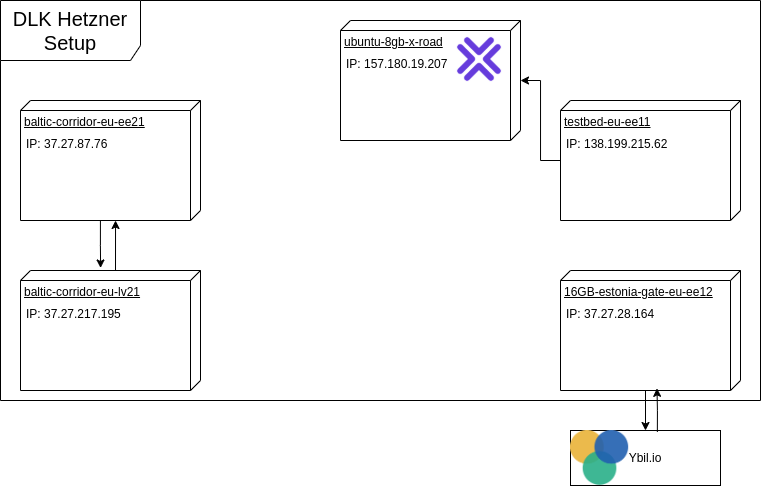

# 1. ARCHITECTURE

The Digilogistics Center of Excellence eFTI Gate project contains the code base of reference implementation for the
eFTI4EU regulation. This reference implementation is still in progress, with the latest release v0.5.0 published on 7.
January 2025 as of writing. It is intended to serve as a base code, base architecture, or test reference that
involved member states can use for their national implementations. The Next version (v0.9) of reference implementation
is
scheduled for December 2025.

The reference implementation provides a minimal code base to run and test the eFTI Gate in conformance with the latest
version of the regulation. It is an open-source, functional implementation with shared code. However, it is explicitly
stated that the reference implementation shall not be used in production as such. Member states are responsible for
adapting it to their specific national requirements. The design and technical choices made in reference implementation
follow general environmental purposes and best practices, but might not suit all use cases, requiring member states to
examine them thoroughly before production use. The available authentication model, though based on OpenID, is very
limited and requires adaptation to respective national authentication systems.

The Gate's development involves different components, designed as independent libraries that are integrated into a
single service. These components are independent enough to be easily used as separate microservices, although
adaptations would be required without needing to change the whole architecture.

To deploy and run the Gate, a set of external dependencies are required. These include databases, message brokers, and
authentication servers. The reference implementation uses PostgreSQL as the main database, RabbitMQ as a message broker
for asynchronous requests, Keycloak as an example authentication server (not for production), and Domibus as the
eDelivery access point. Using Domibus introduces additional dependencies: MariaDB and ActiveMQ.

## 1.1 COMPONENTS

The development of the Digilogistics Center of Excellence eFTI Gate involves different components. These components are
designed as independent libraries that are integrated into a single service. This approach was chosen due to the
simplicity of the gate workflows and the Gate's use of many other components. Although integrated, these components are
independent enough to be easily used as separate microservices, requiring adaptations but not a change to the
entire architecture. All Gate components are separate libraries used to build the Gate microservice.

The developed Gate components include:

- Gate core: This is the main component, implementing the entire Gate process, including interfaces, authentication,
  request handling, external system connections, and workflow definitions. It serves as the entry point for all external
  systems. The gate core can either interact directly with other system parts or pass through other components for some
  processes.
- Registry of identifiers: This component stores the eFTI data identifiers uploaded by platforms and provides an
  interface for querying this data.
- eDelivery connector: This manages communication between the gate and its associated eDelivery access point, which is
  Harmony eDelivery Access point.
- WS plugin: This is a SOAP client used for communication with the eDelivery access point.
- Common library: This includes a set of useful features.
- Logger: This component traces different types of information, including technical logs, audit trails, and statistics.

More detailed descriptions of these components can be found within each component's documentation.

### 1.1.1 GATE CORE

The Gate core is the main component of the eFTI gate. It is responsible for implementing the entire process of the gate.
This involves managing interfaces, handling authentication, processing requests, connecting to external systems, and
defining workflows. The Gate core serves as the entry point for all external systems interacting with the gate.
Depending on the specific process, it may interact directly with other parts of the system or route requests through
other components.

### 1.1.2 REGISTRY OF IDENTIFIERS

The Registry of identifiers component is used to store the eFTI data identifiers that are uploaded by the platforms.
This component also provides a query interface, allowing users or other components to search for the stored data. The
gate's main database, PostgreSQL, is used for the long-term persistent storage required by the registry of identifiers.

### 1.1.3 EDELIVERY CONNECTOR

The eDelivery connector component is tasked with managing the communication between the gate and its associated
eDelivery access point. While the reference implementation uses Domibus as the access point, the Digilogistics Center of
Excellence eFTI project uses Harmony for gate-to-gate connections instead of Domibus. Harmony is a fork of Domibus that
includes more "quality of life features" and better scalability out of the box. The setup, certificate generation, and
connection processes to other gates using Harmony have been largely automated, executable via simple command-line
commands.

### 1.1.4 WS PLUGIN

The WS plugin functions as a SOAP client. Its primary purpose is to communicate with the eDelivery access point. This
means it communicates with the Harmony eDelivery service.

### 1.1.5 COMMON LIBRARY

The Common library component contains logic used by all other parts of the system. Here are message converting
functionality, DTO-s, etc.

### 1.1.6 LOGGER

The Logger component is responsible for tracing different types of information. This includes various logs such as
technical logs, audit trails, and statistics, required by the eFTI regulation.

## 1.2 DEPENDENCIES

This section provides an overview of the essential external tools and components required for successfully deploying and
running the eFTI Gate. It is crucial to understand that while these dependencies are not necessary for building the gate
itself, they are fundamental for its operation once development is complete, and deployment is underway. The eFTI Gate
architecture is designed to integrate various independent components into a single service, and its functionality relies
heavily on several external systems. Specifically, the Digital Logistics Center of Excellence eFTI Gate is based
on the eFTI4EU reference implementation, but it incorporates certain key adjustments regarding these foundational
dependencies.

The primary dependencies required for operating the eFTI gate are:
• Postgresql: This serves as the main database for the gate. It is used for storing long-term persistent data,
particularly for the registry of identifiers, and plays a role in managing the lifecycle of requests.
• RabbitMQ: This functions as a message broker specifically designed to handle asynchronous requests. Requests that
operate asynchronously, such as those related to eDelivery interfaces, are placed into an appropriate queue within
RabbitMQ before processing.
• Harmony: For establishing gate-to-gate connections via an eDelivery service, the Digital Logistics eFTI Gate employs
Harmony. Harmony is a fork of Domibus made by the Nordic Institute for Interoperability Solutions NIIS. The setup,
certificate generation, and the process of connecting to other gates using Harmony have been automated for ease of use.

### 1.2.1 HARMONY

Harmony is an eDelivery access point implementation used by the Digital Logistics Center of Excellence eFTI gate
for gate-to-gate connections. It is a fork of Domibus, which is the eDelivery (AS4) access point implementation provided
by the European Commission and used in the reference implementation.
Harmony is utilized specifically for communication between different eFTI Gates via the eDelivery service. Establishing
a connection between Gates using eDelivery requires both sides to update their certificates. The process of connecting
Gates using eDelivery involves editing the PMode file to include an entry for the remote gate's party name and endpoint.
It also requires adding the remote Gate certificates to the Truststore and TLS tabs in the eDelivery service UI. The
Digital Logistics implementation has automated the setup, certificate generation, and connection process to
other Gates as much as possible, allowing creation, updating certificates, and establishing connections using simple
command-line commands.

Harmony was chosen for the Digital Logistics eFTI Gate because it offers a better user experience and improved
scalability, especially with supported load‑balancing, while maintaining full compatibility with existing Domibus
environments. Since Harmony is built directly on the Domibus codebase, it supports all Domibus plugins and AS4
functionality out of the box, enabling seamless interoperability between Harmony and Domibus access points. This means
test environments can run Harmony and Domibus side by side, exchange messages, share plugin components, and integrate
with the same eDelivery policy domains without any disruption.

### 1.2.2 RABBITMQ

RabbitMQ is a message broker used by the eFTI Gate to handle asynchronous requests, particularly for interfaces like
eDelivery that require queueing due to their asynchronous nature. In the reference implementation, the authority-to-gate
REST API also uses RabbitMQ to manage asynchronism via a polling mechanism, where the authority receives a request ID
and periodically checks for a response.
In the Digilogistic’s Gate, this has been changed: the authority API is now fully synchronous, eliminating the
polling mechanism and RabbitMQ’s role in processing authority requests. RabbitMQ remains essential for other
asynchronous flows, such as gate-to-gate communication and eDelivery interactions, ensuring efficient handling of
multiple requests without blocking.

### 1.2.3 POSTGRESQL

PostgreSQL is the main database used by the eFTI Gate. It is a widely used relational database system.
PostgreSQL serves two primary purposes within the Gate. Firstly, it is used for storing long-term persistent data, with
its main function being the registry of identifiers. This registry stores the eFTI data identifiers uploaded by
platforms and provides a query interface for this data. Secondly, PostgreSQL is used to manage the lifecycle of requests
and for other useful purposes like platform and authority user application management.

## 1.3 DIAGRAMS

Diagram of the project architecture

Diagram of the deployments to Hetzner

